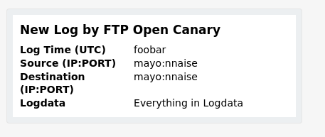

# Opencanary to MS Teams
Opencanary to MS Teams is a small python script that will listen to the canary log and forward the contents to Microsoft Teams via the incoming webhook connector.
By default, opencanary itself supports MS Teams Webhooks as well and should be the preferred solution. If for any reason you want to customize the card further, this script should help.

### Setup
_Currently each logline is sent as an individual message to MS Teams. Upon start of the listener this might produce a few more events depending on the log. You might want to clear the log first._

- Create an incoming webhook connector in MS Teams
- In the terminal, cd into this directory.
- Install python requests and run a venv: `python3 -m venv venv && source venv/bin/activate && pip install -r requirements.txt`
- run `export TEAMS_WEBHOOK="FOO" && python3 main.py`
- If your log file is not at the default `/var/tmp/opencanary.log` you can also `export CANARY_LOG_PATH=<mypath>`.

_That's it already._

The MS Teams Card will look something like this:

